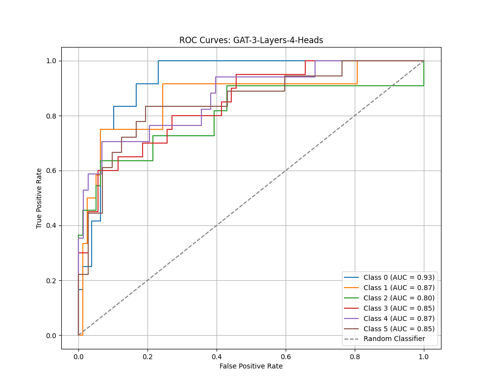

# **Graph Classification on ENZYMES Dataset**

This repository contains the implementation for **graph classification** using **Graph Convolutional Networks (GCN)** and **Graph Attention Networks (GAT)**. The project utilizes the **ENZYMES dataset**, where each graph represents a protein, and the goal is to classify the enzyme class it belongs to. The models are built with **PyTorch Geometric**, and the best-performing configurations are highlighted.

---

## **Repository Structure**

```
.
├── data/                        # Folder containing the ENZYMES dataset
├── weights/                     # Saved model weights
├── utils/                       # Utility scripts (evaluator, visualization, etc.)
│   └── evaluator.py             # For calculating metrics and plotting AUC curves
├── methods/                     # Data preprocessing and analysis scripts
│   ├── data_preprocessing.py    # Preprocess dataset and create data loaders
│   └── exploration_data_analysis.py  # Analyze dataset and visualize graphs
├── models/                      # Graph model implementations
│   ├── graph_model.py           # GCN implementation and experiments
│   └── graph_attention_network.py  # GAT implementation and experiments
├── main.py                      # Main script for running experiments
├── test_model.py                # Test script for evaluating the best model
├── requirements.txt             # List of dependencies
└── README.md                    # Project documentation
```

---

## **Steps of the Project**

### **1. Exploratory Data Analysis**

- The dataset contains **600 graphs** with **37 nodes**, **168 edges**, and **3 features per node**.
- The classification task involves predicting the enzyme class (6 classes).
- The dataset is split into:
  - Training: 70%
  - Validation: 15%
  - Testing: 15%

### **2. Model Implementation**

| **Model** | **F1 Score** | **Accuracy** |
| --- | --- | --- |
| **GCN (1 Layer)** | 0.3733 | 0.3667 |
| **GCN (2 Layers)** | 0.5692 | 0.5667 |
| **GCN (5 Layers)** | 0.5249 | 0.5222 |
| **GAT (2 Layers, 2 Heads)** | 0.4317 | 0.4556 |
| **GAT (3 Layers, 4 Heads)** | 0.5622 | 0.5556 |

---

## **Best Model**

The **GCN with 2 Layers** achieved the best performance with the following metrics:

- **F1 Score**: 0.5692
- **Accuracy**: 0.5667

### **Learning Rate Experiments**

| **Learning Rate** | **F1 Score** | **Accuracy** |
| --- | --- | --- |
| **0.001** | 0.5136 | 0.5222 |
| **0.01** | 0.4627 | 0.4556 |
| **0.1** | 0.3652 | 0.3889 |

---

### **AUC Curves for the Best Model**

#### **GCN with 2 Layers**


- **Observation**:
  - AUC values range between **0.70 and 0.87**, showing consistent performance across classes.
  - Class 2 achieves the highest AUC score of **0.87**, highlighting the model's ability to distinguish between enzyme classes.

---

### **Other Notable Model: GAT with 3 Layers and 4 Attention Heads**



- **Observation**:
  - AUC values range from **0.80 to 0.93**.
  - Class 0 achieves the highest AUC score of **0.93**, indicating strong performance in specific classes.

---

## **How to Run**

### **Training**

To train the models, execute the following command:

```bash
python main.py
```

This script preprocesses the dataset, trains multiple GCN and GAT configurations, and evaluates their performance.

---

### **Testing**

To test the best-performing model (GCN with 2 layers), execute:

```bash
python test_model.py
```

The `test_model.py` script will load the dataset, apply the saved model weights from `weights/gcn_2_layers.pt`, and generate performance metrics along with the AUC curve.

---

## **Requirements**

Install all dependencies with:

```bash
pip install -r requirements.txt
```

---

## **Results Summary**

- **Best Model**: GCN with 2 Layers
- **Best Learning Rate**: 0.001
- **AUC Curves**: Consistently show stable and reliable classification across enzyme classes.

---

## **References**

1. K. M. Borgwardt, et al., "Protein function prediction via graph kernels," *Bioinformatics*, 2005.
2. I. Schomburg, et al., "Brenda, the enzyme database," *Nucleic Acids Research*, 2004.


This repository provides a complete workflow for graph classification tasks, including preprocessing, training, and evaluation. For any inquiries or suggestions, please contact **Adonai Vera** at [GitHub](https://github.com/AdonaiVera/graph-classification-enzymes).


